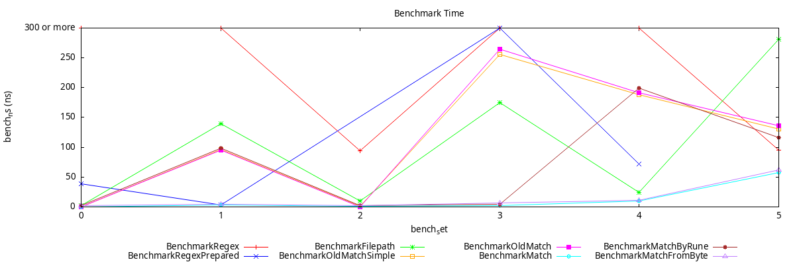
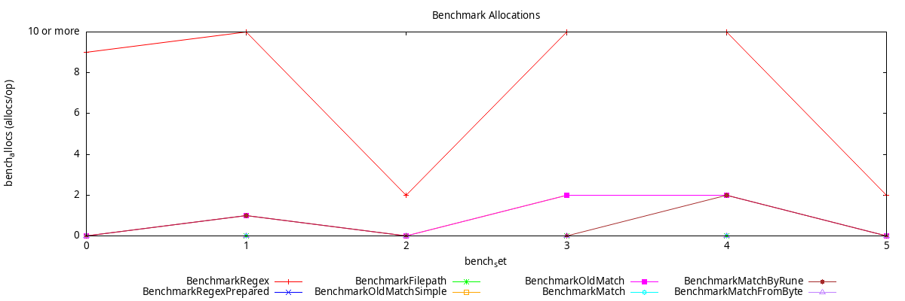

# 🃏 Wildcard Package

[](https://pkg.go.dev/gitlab.com/iglou.eu/goulc/wildcard)

A simple and fast wildcard pattern matching for Go. Regex is much more complex and slower (even when prepared), and `filepath.Match` is file-name-centric. This package is a very fast and very simple alternative to regex, not tied to filename semantics, with no dependencies and allocation-free for the byte path in the common case (see [Semantics](#-semantics) for the single exception). 🥳

## 🎯 Features

- **🧰 Pattern Operators:**
  - `*` matches zero or more characters
  - `?` matches zero or one character
  - `.` matches exactly one character
  - Any other character must match itself

- **🛠️ API Variants:**
  - `Match(pattern, s string) bool`: fastest, compares byte by byte, no allocation in the common case.
  - `MatchFromByte(pattern, s []byte) bool`: same byte-wise semantics for `[]byte` inputs, skips the string conversion.
  - `MatchByRune(pattern, s string) bool`: compares rune by rune. Slower and the `[]rune` conversion allocates, but operators apply to whole Unicode code points.

## 🧭 Semantics

- Matching is **anchored**: the whole input is compared against the whole pattern, there is no substring search.
- `?` is a true **zero or one**: both readings are explored, so `a?b` matches `ab` as well as `axb`, wherever the `?` sits.
- `Match` and `MatchFromByte` operate on **bytes**: a multi-byte UTF-8 character counts as several bytes, so `.` does not match an emoji. `MatchByRune` operates on code points instead, and decodes invalid UTF-8 bytes as U+FFFD, which makes two distinct invalid bytes compare as equal.
- Worst-case cost is **O(len(pattern) × len(s))** and adversarial inputs reach it (for instance `*` followed by a long literal tail). Bound both lengths before matching when the pattern and the input are both untrusted.
- The byte path never allocates, except for patterns longer than 63 bytes that contain `?`.

> ⚠️ **WARNING:** Unlike the GNU "libc", this library has no equivalent to `FNM_FILE_NAME`. For filename matching, use [`path/filepath`](https://pkg.go.dev/path/filepath#Match).

## 📝 Examples

Usage examples can be found in the [examples](../examples/wildcard) directory.

## 🛸 Benchmark

The benchmark is run with [`tools/benchmark.sh`](./tools/benchmark.sh), which executes:

```bash
go test -benchmem -bench . gitlab.com/iglou.eu/goulc/wildcard/benchmark
```

The tested functions are:
- `regexp.MatchString`
- `regexp.MatchPreparedString`
- `filepath.Match`
- `oldMatchSimple` (from old MinIO, kept for reference)
- `oldMatch` (from old MinIO, kept for reference)
- `Match` — string with byte comparison
- `MatchByRune` — string with rune comparison
- `MatchFromByte` — byte slice with byte comparison

<!-- BENCHMARK_TABLE:START -->

| Rank | Benchmark | Average ns/op | Samples |
| ---: | --- | ---: | ---: |
| 1 | BenchmarkMatch | 12.55 | 6 |
| 2 | BenchmarkMatchFromByte | 14.88 | 6 |
| 3 | BenchmarkMatchByRune | 70.36 | 6 |
| 4 | BenchmarkFilepath | 105.36 | 6 |
| 5 | BenchmarkRegexPrepared | 108.96 | 4 |
| 6 | BenchmarkOldMatchSimple | 112.08 | 6 |
| 7 | BenchmarkOldMatch | 114.93 | 6 |
| 8 | BenchmarkRegex | 3064.22 | 6 |

<!-- BENCHMARK_TABLE:END -->




## 🕰 History

Originally, this library was a fork from the Minio project, released as [`github.com/IGLOU-EU/go-wildcard`](https://github.com/IGLOU-EU/go-wildcard) under the Apache License 2.0. The goal of the fork was to keep a usable Apache-licensed version after [MinIO migrated to GNU AGPL 3.0](https://github.com/minio/minio/commit/069432566fcfac1f1053677cc925ddafd750730a). The original MinIO wildcard matching code can still be found in [`minio/pkg/wildcard`](https://github.com/minio/pkg/tree/main/wildcard).

The fork was then rewritten end-to-end and switched to the **BSD 3-Clause** license, with the byte-wise, allocation-free `Match` / `MatchFromByte` / `MatchByRune` implementation generated from a single template via `go generate`. The generated matchers have since been merged into a single generic implementation (plus a hand-written rune variant), and the code generator is gone.

It now lives here as a subpackage of [GoULC](../README.md) and is **relicensed under LGPL-3.0-or-later** to align with the rest of the collection. The MinIO-derived implementation is preserved in [`benchmark/old_wildcard_test.go`](./benchmark/old_wildcard_test.go) under its original Apache 2.0 header for comparison only — it is not part of the public API.

## 📜 License

This library is licensed under the [GNU Lesser General Public License v3.0 or later (LGPL v3 or later)](http://www.gnu.org/licenses/lgpl-3.0.html).
